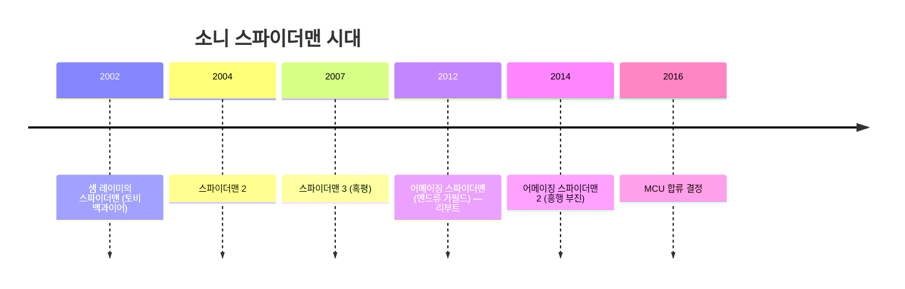

> 스파이더맨 영화를 볼 때마다 소니 로고가 뜨는 게 이상하지 않았나요? 그 사연, 이제 제대로 파헤쳐 봅니다.

## 이 글에서 다루는 내용

- 1990년대 마블 파산 위기와 판권 매각의 배경
- 소니가 스파이더맨을 단돈 700만 달러에 사갈 수 있었던 이유
- '사용하지 않으면 반납' 조건이 만들어낸 끝없는 리부트의 역사
- 소니 단독 스파이더맨 시대의 명과 암

---

## 마블이 스파이더맨을 판 날

지금은 수십조 원짜리 IP 제국이지만, 1990년대 초반의 마블은 그야말로 생존 싸움을 벌이고 있었습니다. 과도한 사업 확장과 코믹스 시장 침체가 겹치면서 1996년 마블은 결국 파산 보호 신청을 냅니다.

돈이 필요했던 마블은 가장 확실한 현금화 수단을 선택했습니다. 바로 인기 캐릭터들의 **영화 제작 판권**을 팔아치우는 것이었죠.

| 캐릭터 | 판권을 가져간 스튜디오 |
|---|---|
| 스파이더맨 | 소니 픽처스 |
| 엑스맨, 판타스틱 4 | 20세기 폭스 |
| 헐크 | 유니버설 픽처스 |
| 블레이드 | 뉴 라인 시네마 |

스파이더맨의 경우 소니 픽처스가 약 **700만 달러**에 판권을 가져갔습니다. 지금 와서 보면 기가 막히는 헐값이지만, 당시 슈퍼히어로 영화의 흥행 가능성을 아무도 확신하지 못했으니 이상한 일도 아닙니다.

## '5년 룰'이 만들어낸 리부트의 역사

소니와 마블의 판권 계약에는 한 가지 중요한 조건이 붙어 있었습니다. **일정 기간 안에 스파이더맨 영화를 제작하지 않으면 판권이 마블로 돌아간다**는 것이었죠.

이 조항이 이후 스파이더맨 영화의 역사를 통째로 뒤흔들게 됩니다.



샘 레이미의 스파이더맨 시리즈는 2편까지는 대성공이었습니다. 하지만 3편이 혹평을 받으면서 4편 제작이 무산됐고, 소니는 판권을 지키기 위해 서둘러 **앤드류 가필드**의 어메이징 스파이더맨으로 리부트를 감행합니다.



그런데 어메이징 스파이더맨 2 역시 기대 이하의 성적을 거두면서 소니는 다시 갈림길에 서게 됩니다. 스파이더맨 유니버스를 계속 혼자 끌고 갈 자신도 없고, 그렇다고 판권을 마블에 돌려주기는 아까운 상황. 그때 마블 스튜디오에서 매력적인 제안이 날아왔습니다.

## 소니 단독 시대, 빛과 그림자

판권 문제 이야기를 하다 보면 잊기 쉬운데, 소니 스파이더맨 시대에도 명작은 있었습니다. 샘 레이미의 **스파이더맨 2(2004)** 는 지금도 최고의 슈퍼히어로 영화 중 하나로 꼽히고, 앤드류 가필드 버전도 나름의 팬층을 형성했죠.

문제는 소니가 **스파이더맨 유니버스를 억지로 확장하려다** 자꾸 무리수를 뒀다는 점입니다. 어메이징 스파이더맨 2에서 무리하게 악당을 여럿 집어넣고, 베놈이나 사이노스터 식스 스핀오프까지 계획했지만 기반이 흔들리면서 전부 엎어졌습니다.

마블 MCU가 아이언맨 이후 착실히 쌓아온 세계관과 비교당하면서 소니의 한계는 더 두드러졌고, 결국 '협상 테이블에 앉는 것'이 소니 입장에서도 최선이라는 결론이 났습니다.

다음 편에서는 그 협상이 어떻게 이루어졌는지, 그리고 '세기의 딜'이 어떻게 성사됐는지 이야기하겠습니다!

