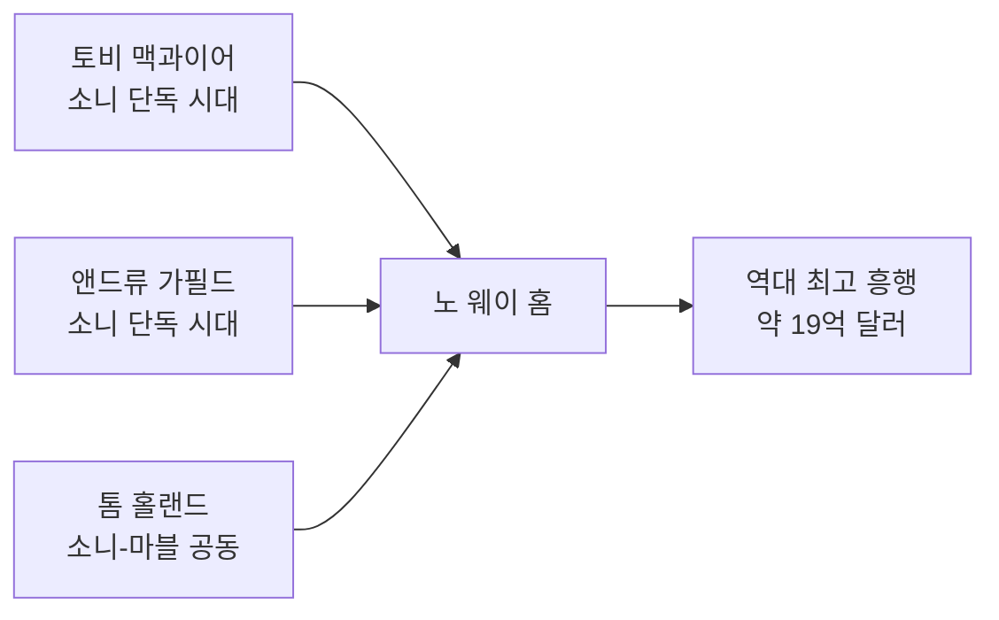

> 판권은 소니, 제작은 마블과 함께. 세상에서 가장 복잡한 공동 제작이 낳은 세계에서 가장 흥행한 영화 이야기입니다.

## 이 글에서 다루는 내용

- 케빈 파이기의 제안과 '세기의 딜'이 성사된 배경
- 소니와 마블의 수익 배분 구조
- 2019년 결별 위기와 극적 재합의 과정
- 노 웨이 홈이 탄생할 수 있었던 이유

---

## 케빈 파이기의 제안: "판권은 네 거, 스파이더맨은 우리 것"

2014년, 어메이징 스파이더맨 2의 성적표를 받아든 소니는 골머리를 앓고 있었습니다. 이때 마블 스튜디오의 수장 **케빈 파이기**가 손을 내밀었습니다.

제안의 골자는 간단했습니다.

> 판권은 소니가 계속 가져가세요. 제작비도 소니가 내고, 극장 수익도 소니가 챙기면 됩니다. 대신 우리가 크리에이티브 가이드를 줄게요. 그리고 스파이더맨을 MCU 영화에도 좀 출연시켜 주세요.

언뜻 마블이 손해 보는 것 같지만, 실은 양쪽 모두에게 이득이었습니다. **소니**는 마블의 창작력과 MCU 세계관을 등에 업고 확실한 흥행을 보장받았고, **마블**은 가장 대중적인 히어로인 스파이더맨을 어벤져스에 넣어 세계관을 완성할 수 있었으니까요.

이 딜의 세부 구조를 정리하면 다음과 같습니다.

| 항목 | 소니 | 마블/디즈니 |
|---|---|---|
| 판권 소유 | ✅ | ❌ |
| 스파이더맨 단독 영화 제작비 | ✅ | ❌ |
| 스파이더맨 단독 영화 수익 | 대부분 | 일부 (약 5%) |
| 크리에이티브 방향 | 협력 | 주도 |
| MCU 크로스오버 영화 | 협력 | 주도 |

이렇게 탄생한 것이 바로 **톰 홀랜드의 스파이더맨**입니다. 시빌 워(2016)에서 첫 등장한 이래 어벤져스 인피니티 워, 엔드게임, 파 프롬 홈까지 MCU의 핵심 멤버로 자리 잡았죠.



## 2019년 결별 위기: "우리 헤어져야 할 것 같아"

하지만 순탄할 것 같았던 동거는 2019년 큰 위기를 맞습니다.



파 프롬 홈이 엄청난 흥행(약 11억 달러)을 기록하자, **디즈니 측에서 수익 배분 재협상을 요구**했습니다. 기존에 마블이 약 5%의 수익만 받던 구조를 50대 50으로 바꾸자는 것이었죠. 소니는 거절했고, 언론에는 '스파이더맨 MCU 퇴출'이라는 충격적인 헤드라인이 쏟아졌습니다.

팬들의 분노는 엄청났습니다. 실제로 톰 홀랜드가 팬미팅에서 이 소식을 전해 듣고 눈물을 글썽였다는 에피소드는 유명하죠. 다행히 몇 주 뒤 양측이 극적으로 합의하면서 파국은 면했습니다. 이때의 합의 내용은 정확히 공개되지 않았지만, 마블이 이전보다 높은 수익 배분을 받는 조건이었을 것으로 추정됩니다.

## 노 웨이 홈: 위기가 낳은 역대급 명작

재합의 이후 세 번째 단독 영화로 기획된 것이 바로 **스파이더맨: 노 웨이 홈(2021)** 입니다.



이 영화는 단순한 속편이 아니었습니다. 멀티버스 설정을 이용해 역대 스파이더맨 세 명, 그리고 역대 빌런들을 한자리에 모은 '슈퍼 팬서비스' 영화였죠. 오랜 세월 소니와 마블로 나뉘어 각자의 세계관에서만 살던 캐릭터들이 한 스크린에 등장할 수 있었던 것도, 역설적으로 이 복잡한 판권 구조 덕분이었습니다.

결과는 모두가 아는 대로입니다. 약 **19억 달러**의 전 세계 흥행을 기록하며 역대 스파이더맨 영화 중 최고, 팬데믹 시대 개봉작 중에서도 손꼽히는 흥행 성적을 냈습니다.

## 엔딩이 남긴 것

노 웨이 홈의 엔딩은 동시에 새로운 시작이었습니다.

닥터 스트레인지의 주문으로 세상 모든 사람이 '피터 파커'를 잊게 되었고, 스파이더맨은 어벤져스 동료도, 사랑하는 MJ도 없이 완전히 혼자가 됩니다. 화려한 스타크 테크놀로지 슈트와 어벤져스 시설의 지원도 사라졌죠.

이 설정이 코믹스의 **'브랜드 뉴 데이'** 에피소드와 같습니다. 시빌 워에서 정체를 공개한 뒤 '원 모어 데이' 이벤트로 모든 기억이 지워지는 그 스토리라인과 정확히 맞닿아 있습니다.

그리고 그 이야기는 2026년 7월, 새로운 영화에서 이어집니다.

