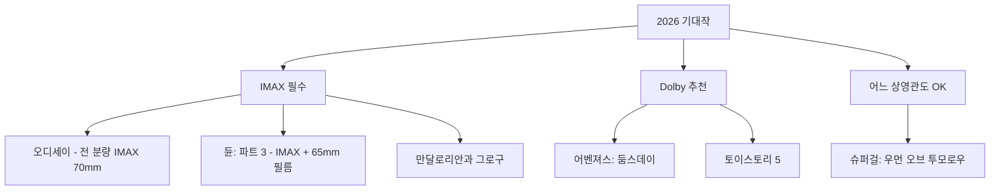

> 2026년은 역대급 라인업의 해입니다. 노란 스크린에 팝콘 들고 앉을 날만 기다리게 만드는 작품들이 줄줄이 대기 중이에요.

## 이 글에서 다루는 내용

- 2026년 3월이후 주요 해외 기대작 8편 총정리
- 감독, 배우, 비하인드 스토리 등 화제가 될 이야깃거리
- 영화별 최적 특별관(IMAX / Dolby) 추천

---

## 📅 한눈에 보는 개봉 라인업

| 개봉 시기 | 제목 | 장르 | 특별관 |
| :--- | :--- | :--- | :--- |
| 2026. 04. 24 | **마이클 (Michael)** | 전기 / 음악 | IMAX |
| 2026. 05. 22 | **만달로리안과 그로구** | SF / 액션 | IMAX |
| 2026. 06. 19 | **토이스토리 5** | 애니메이션 | Dolby Cinema |
| 2026. 06. 26 | **슈퍼걸: 우먼 오브 투모로우** | 액션 / SF | — |
| 2026. 07. 17 | **오디세이 (The Odyssey)** | 액션 / 판타지 | **IMAX 필수** |
| 2026. 07. 31 | **스파이더맨: 브랜드 뉴 데이** | 액션 / SF | IMAX |
| 2026. 12. 18 | **어벤져스: 둠스데이** | 액션 / SF | Dolby Cinema |
| 2026. 12. 18 | **듄: 파트 3** | SF / 드라마 | **IMAX 필수** |
| 2026. 11. 26 | **나니아 연대기 (나니아)** | 판타지 | IMAX |

---

## 🎤 마이클 (Michael) — 2026. 04. 24



**감독:** 앙투안 퓨쿠아 / **주연:** 자파르 잭슨, 콜먼 도밍고, 니아 롱, 마일스 텔러

'팝의 황제' 마이클 잭슨의 일대기를 다룬 전기 영화입니다. 가장 화제가 된 캐스팅 포인트는 실제 조카인 **자파르 잭슨**이 마이클 역을 맡았다는 것. 처음엔 "무명 조카를 주연으로?"라는 의문도 있었지만, 트레일러 공개 이후 분위기는 완전히 뒤집혔어요. 24시간 만에 1억 1,620만 뷰를 기록하며 뮤지컬 바이오픽 역대 최고 기록을 세웠거든요.

영화는 잭슨 파이브 시절부터 솔로 전성기까지를 다루며, 30곡의 오리지널 히트곡이 삽입됩니다. 콜먼 도밍고(조 잭슨)와 니아 롱(캐서린 잭슨)의 연기도 기대 포인트. 제작은 《보헤미안 랩소디》를 만든 그레이엄 킹이 맡았고, 마이클 잭슨 재단의 전폭적인 지원 아래 제작됐습니다.


**화제의 이야기:** 딸 패리스 잭슨은 영화에 참여하지 않았으며 초기 각본이 "지나치게 미화됐다"고 공개 비판했습니다. 성범죄 혐의도 어느 정도 다뤄질 예정이라 개봉 전부터 논란이 예상됩니다.


**🎬 특별관 추천:** IMAX — 문워크와 라이브 퍼포먼스 장면을 압도적인 사운드로 경험하세요.

---

## 🌌 만달로리안과 그로구 — 2026. 05. 22



**감독:** 존 파브로 / **주연:** 페드로 파스칼, 시고니 위버, 제레미 앨런 화이트

《스타워즈》 시리즈의 극장판 귀환입니다. 2019년 《라이즈 오브 스카이워커》 이후 무려 7년 만의 극장 복귀라는 점에서 팬들의 기대가 크죠. 디즈니플러스에서 시즌 3까지 이어온 딘 드자린(만달로리안)과 그로구의 이야기를 스크린 스케일로 펼쳐냅니다.

흥미로운 캐스팅은 **시고니 위버**의 합류(뉴 리퍼블릭 소령 워드 역)와, 성우로만 등장하는 **마틴 스코세이지** — 외계인 요리사를 맡았다고 해서 영화팬들 사이에서 화제입니다. 또한 애니메이션 출신 캐릭터 제브도 실사로 등장할 예정.

**🎬 특별관 추천:** IMAX — 공식적으로 IMAX 촬영 포맷으로 제작됐습니다.

---

## 🧸 토이스토리 5 — 2026. 06. 19



**감독:** 앤드류 스탠튼, 켄나 해리스 / **주연(성우):** 톰 행크스, 팀 앨런, 그레타 리

"이번엔 마지막이야"라고 했던 4편 이후 5편이 나옵니다. 이번 이야기의 키워드는 **Toy meets Tech**. 새로운 악당(?)은 태블릿 기기 '릴리패드'. 장난감들의 자리를 위협하는 전자기기와의 대결 구도가 현 시대와 맞닿아 있어 흥미롭습니다.

《니모를 찾아서》, 《WALL·E》로 픽사의 황금기를 이끈 앤드류 스탠튼 감독의 복귀라는 점도 기대 포인트. 한편 창립자 존 라세터 없이 만들어지는 첫 토이스토리이기도 합니다.

**🎬 특별관 추천:** Dolby Cinema — 픽사 특유의 선명하고 감성적인 색감을 Dolby의 HDR로 즐겨보세요.

---

## ⚡ 슈퍼걸: 우먼 오브 투모로우 — 2026. 06. 26



**감독:** 크레이그 길레스피 / **주연:** 밀리 알콕

제임스 건의 새 DC 유니버스(DCU)의 핵심 기대작입니다. 올해 개봉한 《슈퍼맨》 쿠키 영상에서 잠깐 모습을 드러낸 밀리 알콕의 슈퍼걸이 드디어 단독 영화로 등장합니다. 원작은 톰 킹의 2022년 동명 코믹스로, 기존의 '슈퍼맨의 사촌' 이미지를 벗어나 훨씬 어둡고 거친 기원 이야기를 다룹니다.

외계 소녀와 함께 은하 저편까지 복수 여행을 떠나는 서사라, 전통적인 슈퍼히어로 영화와는 결이 꽤 다를 것으로 보입니다. 밀리 알콕은 《왕좌의 게임: 드래곤 하우스》에서 어린 라에니라 역으로 주목받은 배우.

---

## 🏛️ 오디세이 (The Odyssey) — 2026. 07. 17 ⭐ 올해 최고 기대작



**감독:** 크리스토퍼 놀란 / **주연:** 맷 데이먼, 톰 홀랜드, 앤 해서웨이, 젠데이아, 로버트 패틴슨, 샤를리즈 테론

올해 기대작 중 단연 최상위. 《오펜하이머》로 아카데미를 휩쓴 크리스토퍼 놀란이 호메로스의 서사시 《오디세이아》를 스크린으로 옮깁니다.

놀란의 13번째 장편이자 **인류 최초의 모험 이야기**를 다루는 이 작품은, 놀란 역대작 중 최고 제작비인 2억 5천만 달러가 투입됐습니다. 그리고 가장 중요한 포인트 — **역사상 최초로 전 분량을 IMAX 70mm 필름 카메라로 촬영한 영화**입니다. 모로코, 그리스, 이탈리아, 스코틀랜드, 아이슬란드 등 5개국 실제 로케이션에서 91일간 촬영했어요.

캐스팅도 화제입니다. 맷 데이먼(오디세우스), 젠데이아(아테나), 톰 홀랜드(텔레마코스), 앤 해서웨이(페넬로페), 로버트 패틴슨(안티노우스), 샤를리즈 테론(키르케)… 놀란 특유의 스타 앙상블이 이번에도 완성됐습니다. 음악은 《오펜하이머》에 이어 루드비히 괴란손이 담당.

티켓 예매가 개봉 1년 전에 오픈됐는데 **몇 시간 만에 조기 매진**됐다는 것도 기대감을 증폭시킵니다. IMDb 기준 2026년 가장 기대되는 영화 1위, Variety는 "올해 최고 흥행작이 될 것"으로 예측하고 있어요.


RDJ(로버트 다우니 주니어)는 원래 포세이돈 역 제안을 받았으나 《어벤져스: 둠스데이》 촬영 일정 충돌로 거절했다고 합니다. 만약 성사됐다면 놀란+RDJ의 조합이라는 상상만으로도...


**🎬 특별관 추천:** **IMAX 무조건** — 전 분량이 IMAX 70mm로 찍혔습니다. IMAX 아니면 극장 의미 없다는 말이 이 영화만큼 딱 맞는 경우도 드물어요.

---

## 🕷️ 스파이더맨: 브랜드 뉴 데이 — 2026. 07. 31



**감독:** 데스틴 다니엘 크레톤 / **주연:** 톰 홀랜드, 젠데이아, 존 베른탈, 세이디 싱크

《노 웨이 홈》 이후 4년. 스트레인지의 마법으로 전 세계가 피터 파커를 잊어버린 세계에서, 그는 혼자 뉴욕을 지키고 있습니다. 영화의 부제 '브랜드 뉴 데이'는 2008년 코믹스 스토리라인에서 따온 것으로, 피터가 완전히 새로운 출발을 하는 이야기를 암시합니다.

트레일러가 공개되자마자 **24시간 만에 7억 1,860만 뷰**라는 역대 최다 기록을 세웠습니다. 이전까지의 역대 기록을 훌쩍 뛰어넘은 수치로, 전 세계적인 팬덤의 기대감을 그대로 보여줬죠.

존 베른탈이 퍼니셔로 합류한다는 점도 화제. 세이디 싱크는 역할이 공개되지 않아 추측이 무성합니다. 촬영 도중 톰 홀랜드가 스턴트 촬영 중 뇌진탕을 입어 촬영이 일주일 중단되는 사고도 있었습니다.

**🎬 특별관 추천:** IMAX — 웹 스윙 액션의 속도감과 뉴욕의 스카이라인을 대화면으로 즐기세요.

---

## 🌪️ 어벤져스: 둠스데이 — 2026. 12. 18

**감독:** 루소 형제 / **주연:** 로버트 다우니 주니어(닥터 둠), 크리스 헴스워스, 앤서니 매키, 페드로 파스칼, 패트릭 스튜어트 외 대규모 앙상블

MCU 역사상 가장 충격적인 캐스팅 발표가 있었죠. 아이언맨으로 사망한 RDJ가 이번엔 **빌런 닥터 둠**으로 돌아옵니다. 2024년 샌디에이고 코믹콘 Hall H에서 RDJ가 직접 무대에 등장했을 때 현장의 함성은 전설로 남았죠.

어벤져스, 판타스틱 포, 엑스맨이 한 자리에 집결하는 멀티버스 대전입니다. 크리스 에반스(스티브 로저스)도 복귀 확정. 패트릭 스튜어트(프로페서 X), 이안 맥켈런(매그니토), 채닝 테이텀(감빗)까지 FOX 뮤턴트들이 대거 MCU에 합류합니다.

예산은 **10억 달러**에 달하는 것으로 알려져, 역대 가장 비싼 영화가 될 가능성도 있습니다.


같은 날(12월 18일) 《듄: 파트 3》도 동시 개봉합니다. 한국 시장에서는 IMAX 스크린 확보 경쟁이 치열할 수 있어요. 미국에서는 둠스데이가 최소 3주간 IMAX 독점권이 없어 Dolby Cinema가 주력 포맷이 됩니다.


**🎬 특별관 추천:** Dolby Cinema — IMAX 스크린이 듄 3에 집중될 수 있으므로, Dolby Cinema로 관람하는 것이 현실적인 대안.

---

## 🪐 듄: 파트 3 — 2026. 12. 18 ⭐ 올해의 또 다른 주인공



**감독:** 드니 빌뇌브 / **주연:** 티모테 샬라메, 젠데이아, 플로렌스 퓨, 로버트 패틴슨, 레베카 퍼거슨, 하비에르 바르뎀, 제이슨 모모아

드니 빌뇌브의 폴 아트레이드 3부작이 완성됩니다. 원작 소설 《듄 메시아》를 기반으로 하되, 영화에서는 파트 2 이후 **17년 뒤**로 시간 점프합니다. 황제가 된 폴이 자신의 선택이 불러온 참혹한 결과—61억 명의 죽음—와 마주하는 이야기입니다.

빌뇌브 감독은 "내 가장 개인적인 영화이자, 매우 현재적인 이야기"라고 설명했습니다. 공동 각본에는 《Y: 더 라스트 맨》의 브라이언 K. 본이 참여했고, 음악은 한스 짐머가 다시 맡았습니다.

촬영은 일부 IMAX 카메라를 사용했으며, IMAX가 아닌 파트는 코닥 65mm 필름(디지털이 아닌 아날로그 필름!)으로 찍었습니다. 파트 1, 2를 디지털로 찍은 것과 대비되는 변화로, 더욱 질감 있는 영상이 기대됩니다.

로버트 패틴슨은 적대자 스카이탈 역으로 합류. 제이슨 모모아도 던컨 아이다호(하이트)로 복귀하며, 모모아의 실제 아들이 레토 2세 역을 맡는 깜찍한 캐스팅도 눈길을 끕니다.

**🎬 특별관 추천:** **IMAX 최우선** — 분명히 IMAX 스케일에 맞게 제작됐습니다. 한국에서 IMAX GT(1.43:1 비율) 상영관이 있다면 무조건 거기로.

---

## 🦁 나니아 연대기 (The Chronicles of Narnia) — 2026. 11. 26 (예정)



**감독:** 그레타 거윅 / **주연:** 에마 매키, 대니얼 크레이그, 케리 멀리건, 메릴 스트립

《바비》로 전 세계를 사로잡은 **그레타 거윅 감독**의 차기작입니다. C.S. 루이스의 나니아 연대기 중 시간 순서상 첫 번째 이야기인 《마법사의 조카》를 원작으로 합니다. 넷플릭스와 공동 제작으로, **IMAX 제한 상영 후 넷플릭스 스트리밍**으로 전환될 가능성이 높습니다.

캐스팅이 화려합니다. 에마 매키, 대니얼 크레이그(제임스 본드 이후 행보), 케리 멀리건, 메릴 스트립까지. 거윅 감독 특유의 감성이 판타지 세계관과 어떻게 결합될지 궁금증을 자아냅니다.

**🎬 특별관 추천:** IMAX — 제한 상영 기간에 극장에서 보지 않으면 스트리밍으로 넘어가버릴 수 있으니 IMAX 상영 기간을 놓치지 마세요.

---

## 🏆 결론: 2026년 극장 관람 우선순위

올해만큼 "무조건 극장에서 봐야 하는" 영화들이 쏟아지는 해도 드뭅니다. 특히 아래 세 편은 특별관 경험이 영화 자체의 완성도에 직결됩니다.

개봉일이 겹치는 12월 18일, 《어벤져스: 둠스데이》와 《듄: 파트 3》의 IMAX 스크린 경쟁이 어떻게 펼쳐질지도 관전 포인트입니다. 미리 좌석 확보해두시는 걸 추천해요. 이 정도 라인업이라면 연간 영화 관람 예산을 다시 짜야 할지도 모르겠네요. 😅
