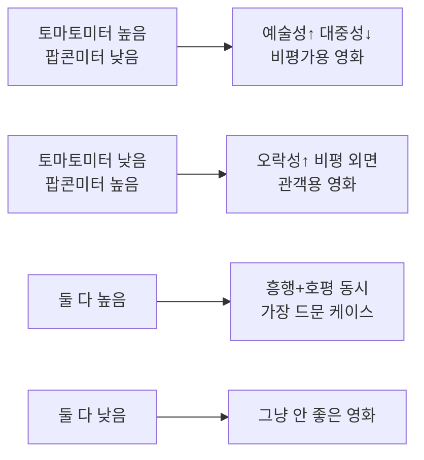

> 로튼토마토 점수가 높으면 좋은 영화, 낮으면 나쁜 영화? 그렇게 단순하지 않다.

## 이 글에서 다루는 내용

- 토마토미터와 팝콘미터가 뭐가 다른지
- Certified Fresh, Fresh, Rotten 기준
- 점수가 낮아도 볼 만한 영화가 생기는 이유
- 실전에서 점수를 어떻게 읽을지

---

## 로튼토마토에는 점수가 두 개다


로튼토마토에 들어가면 숫자가 두 개 보인다. 빨간 토마토 아이콘 옆의 **토마토미터(Tomatometer)** 와 팝콘 아이콘 옆의 **팝콘미터(Popcornmeter, 구 Audience Score)** 다.

| 점수 | 집계 대상 | 의미 |
|---|---|---|
| 토마토미터 | 공인된 평론가·미디어 리뷰 | 비평가들이 얼마나 긍정적으로 봤나 |
| 팝콘미터 | 일반 관객 평점 | 실제 관객이 얼마나 즐겼나 |

둘 다 단순한 평균 점수가 아니다. "이 리뷰가 긍정적인가 부정적인가"로 분류한 뒤, **긍정 비율**을 백분율로 보여주는 구조다. 별점 3.5/5짜리 리뷰도 긍정으로 분류되면 토마토미터를 올린다.

---

## Certified Fresh, Fresh, Rotten이 뭔가

토마토 색깔에 따라 세 등급으로 나뉜다.

```
🍅 Certified Fresh  — 토마토미터 75% 이상 + 리뷰 수 조건 충족
🍅 Fresh            — 토마토미터 60% 이상
🍅 Rotten           — 토마토미터 59% 이하
```

**Certified Fresh**가 되려면 점수만 높아선 안 된다. 최소 리뷰 수 조건도 있다. 일반 개봉작은 평론가 리뷰 80개 이상, 제한 개봉작은 40개 이상이 기준이다. 리뷰가 적은 독립영화나 소규모 개봉작이 높은 점수를 받아도 Certified Fresh를 못 받는 이유가 여기 있다.


Certified Fresh 배지는 한 번 받아도 이후 리뷰가 쌓이면서 점수가 떨어지면 박탈될 수 있다. 개봉 초반 점수만 믿으면 안 되는 이유다.


---

## 토마토미터와 팝콘미터가 크게 다를 때

두 점수 차이가 클수록 흥미로워진다.




실제로 이런 차이가 크게 벌어지는 경우가 있다. 비평가들에게 외면받았지만 관객들이 열광한 작품, 반대로 평론가 만장일치인데 일반 관객에겐 지루한 작품. 둘의 괴리를 보면 영화의 성격이 보인다.


슈퍼히어로 영화가 대표적이다. 액션 블록버스터는 팝콘미터가 높고 토마토미터는 중간치인 경우가 많다. 반면 느린 호흡의 아트하우스 영화는 정반대.


---

## 점수를 실전에서 읽는 법

### 리뷰 수를 같이 본다

점수가 100%라도 리뷰가 5개면 의미가 없다. 반대로 리뷰 300개에 72%면 꽤 신뢰할 만하다. 항상 **점수 옆의 리뷰 수**를 같이 확인하는 습관이 중요하다.

### 장르 맥락을 고려한다

공포 영화의 평균 토마토미터는 드라마보다 전반적으로 낮다. 같은 60%라도 공포 장르에선 준수한 편, 드라마 장르에선 아슬아슬한 편일 수 있다. 장르 내 상대적 위치를 파악하면 더 정확하다.

### 평론가 코멘트를 몇 개 읽는다

점수만 보지 말고 **상단에 노출되는 평론가 코멘트 3~4개**를 읽어보는 게 훨씬 낫다. "시각적으로 화려하지만 서사가 빈약하다"는 Fresh 리뷰가 있다면, 스토리를 중요하게 생각하는 사람에겐 그게 Rotten과 다름없다.


팝콘미터는 2023년부터 인증된 티켓 구매자만 참여할 수 있도록 바뀌었다. 이전까진 계정만 있으면 누구나 평점을 남길 수 있어서 조직적 평점 테러나 띄우기가 심했다. 오래된 영화의 팝콘미터는 이 맥락을 고려해서 봐야 한다.


---

## 마치며

로튼토마토는 "이 영화가 좋은가 나쁜가"를 알려주는 도구가 아니다. **"이 영화에 대해 긍정적으로 반응한 사람이 얼마나 되는가"** 를 보여주는 도구다. 그 미묘한 차이를 이해하면 점수가 훨씬 다르게 읽힌다.

토마토미터 40%짜리 영화를 즐겁게 보고 나온 경험이 누구에게나 한 번쯤은 있을 거다. 그게 틀린 게 아니다. 점수는 참고용이고, 결국 선택은 내 취향이 하는 거니까.
